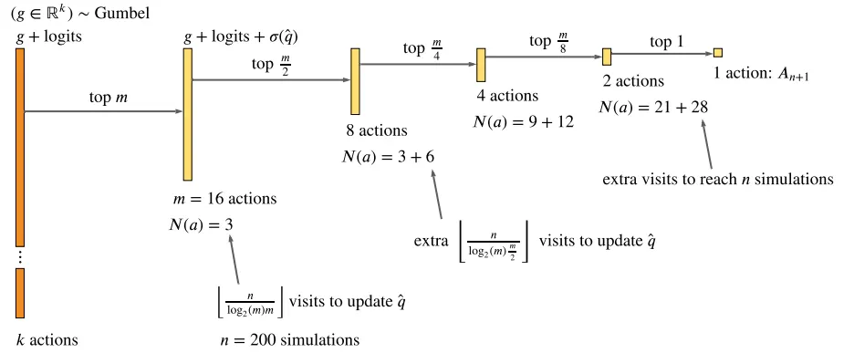

# gumbel-mcts

A lightweight and numba-accelerated Gumbel MCTS implementation. 

Optimized for speed! Generates hundreds of thousands of sims / sec. :rocket:

See [gumbel-mcts-benchmark](https://github.com/olivkoch/gumbel-mcts-benchmark) for full benchmark.

<p align="center">
  <br>
  <small><i>Source:https://medium.com/correll-lab/planning-with-gumbel-036018b180bf</i></small>
</p>

## Description

Gumbel sampling brought tremendous progress to MCTS, but efficient standalone implementation of Gumbel MCTS are missing.

We provide three MCTS implementations:

- `puct.py`: an efficient implementation of PUCT MCTS. It produces the exact same output as a reference [mcts_v2.py](https://github.com/michaelnny/alpha_zero/blob/main/alpha_zero/core/mcts_v2.py) but but with a **2-20X speedup**. 

- `gumbel_dense.py`: an implementation of [Policy improvement by planning with Gumbel](https://openreview.net/forum?id=bERaNdoegnO), offering **massive performance improvement when the simulation budget is low**

- `gumbel_sparse.py`: a sparse implementation of Gumbel MCTS, particularly useful for games with large action spaces (e.g. chess)

## Usage

```python

def play_game():
    logic = TicTacToeLogic()
    model = TinyModel()
    model.eval()

    board = np.zeros((3, 3), dtype=np.int8)
    player = 1
    symbols = {0: ".", 1: "X", 2: "O"}

    while True:
        tree = GumbelSparse(n_games=1, max_nodes=500, device="cpu", logic=logic)
        tree.initialize_roots([0], board.ravel()[None], np.array([player]))
        move = tree.run_simulation_batch(model, [0], num_simulations=50)
        action = move[0]

        _, winner, done, board = logic.fast_step(board, action, player)
```

## Illustration

Gumbel MCTS makes much better use of its simulation budget. With 8 sims on Gomoku, Gumbel finds the strategic moves while PUCT concentrates its visit counts at the wrong place.

<p align="center">
  
</p>
